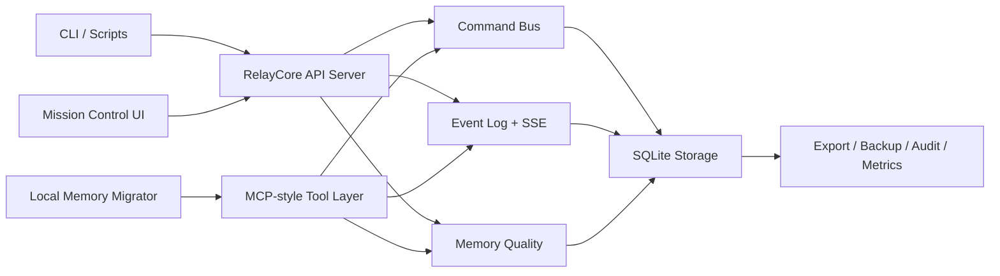

# RelayCore

> 面向 Codex、Claude 等本地 AI Runtime 的跨 Agent 记忆与命令中继控制面。

`中文为主` | `English available below`

## 中文

RelayCore 是一个面向本地或自托管 AI Runtime 的共享记忆与命令中继项目。当前仓库包含：

- SQLite 共享存储
- 结构化 command bus
- append-only event timeline
- digest 生成
- MCP-style memory / command tools
- Mission Control Web UI
- export、backup、metrics、audit、CORS、token 相关接口
- 本地 Claude / Codex memory 迁移脚本

## 文档

- [构建路线图](docs/ROADMAP.md)
- [发布信息](docs/RELEASE_READINESS.md)
- [当前 Release 文案](docs/GITHUB_RELEASE_v0.1.2.md)

## 跨项目横向对比

下表只基于公开仓库描述和公开可见接口整理，用来展示不同项目当前公开强调的能力侧重。

| 对比维度 | RelayCore | EastSword/EchoMemory | Mem0 | OpenMemory | Cognee |
| --- | --- | --- | --- | --- | --- |
| 公开定位 | 跨 Agent 共享记忆与命令中继控制面 | 多 Agent 共享记忆项目 | 面向 AI Agents 的通用记忆层 | 面向 LLM 与 agents 的 memory engine | 面向 agents 的开源 AI memory platform |
| 主要交互面 | CLI、REST API、MCP-style tools、Web UI、迁移脚本 | 以公开仓库描述为主 | CLI、SDK、平台 / 云服务材料 | Python SDK、Node SDK、server、MCP、UI、connectors | Python package、plugins、clients、公开文档 |
| 共享记忆 | 有 | 公开描述中强调 | 公开材料中强调 user / session / agent memory | 公开材料中强调长期记忆与 recall traces | 公开材料中强调 persistent memory |
| 结构化命令总线 | 有，仓库内包含 command bus | 公开材料未在此仓库对外展开 | 公开材料更强调 memory layer | 公开材料更强调 memory engine / recall | 公开材料更强调 remember / recall 与 graph workflow |
| 事件时间线 / digest | 有，仓库内包含 event timeline 与 digests | 公开材料未在此仓库对外展开 | 公开材料未作为主轴强调 | 公开材料强调 traces / observability | 公开材料更强调知识图谱与记忆检索 |
| 面向 Codex / Claude 的本地接入 | README 与仓库内包含 Codex / Claude 相关接入与迁移脚本 | 公开材料未在此仓库对外展开 | 公开材料更偏 SDK / 平台接入 | 公开材料强调 MCP 与多类集成 | 公开材料更偏 Python agent / cloud / graph 方案 |
| 本地 / 自托管存储形态 | 当前仓库实现为 Python + SQLite | 公开材料未在此仓库对外展开 | 公开材料包含平台 / 托管路径 | 公开材料强调 local-first，支持 SQLite / Postgres | 公开材料强调 self-hosted knowledge graph engine |
| 运维 / 操作界面 | 有 Mission Control Web UI、export、backup、metrics、audit | 公开材料未在此仓库对外展开 | 公开材料更偏平台与 API 使用 | 公开材料强调 UI、integrations、memory traces | 公开材料更偏图谱 / 插件 / 平台能力 |
| 本地历史迁移 | 当前仓库包含 Claude / Codex memory 迁移脚本 | 公开材料未在此仓库对外展开 | 公开材料未以本地历史迁移为主轴 | 公开材料更强调 connectors / sources | 公开材料更强调数据接入与图谱工作流 |

说明：

- RelayCore 的特点主要体现在“共享记忆 + 结构化命令总线 + 事件时间线 + 本地迁移 + 面向 Codex/Claude 的仓库内接入说明”这一组合上。
- 该表用于展示能力侧重差异，不做评分或结论排序。

## 构建导图



## 快速开始

```bash
python -m venv .venv
source .venv/bin/activate
pip install -e .[dev]
relaycore init-db
relaycore serve --host 127.0.0.1 --port 8080
```

打开：

- `http://127.0.0.1:8080/mission-control`

也可以直接使用模块入口：

```bash
python -m relaycore init-db
python -m relaycore serve --host 127.0.0.1 --port 8080
```

## Memory 迁移

只预览、不写库：

```bash
python scripts/migrate_local_memories.py --dry-run
```

显式包含历史摘要和支持的 runtime store：

```bash
python scripts/migrate_local_memories.py --dry-run --include-history --include-runtime-store
```

实际导入：

```bash
python scripts/migrate_local_memories.py --session-id local-memory-migration
```

## CLI

可用入口：

```bash
relaycore init-db
relaycore serve
relaycore export
```

## 测试

```bash
pytest
```

当前本地测试结果（2026-07-19）：`46 passed`

## 仓库结构

- `relaycore/`: 核心实现包
- `scripts/`: 迁移与辅助脚本
- `tests/`: 自动化测试
- `docs/`: 路线图、发布评估、阶段文档与决策记录

## 后续优化 TODO

- Docker 化
- 反向代理部署示例
- 环境变量与配置文档
- 更完整的 CLI smoke tests
- 在 Mission Control 中加入导入预览与勾选确认
- 增加更多 Claude / Codex source adapters
- 增加导入回滚与 snapshot 说明
- 更完整的 observability
- 恢复演练和运维 runbook
- 多用户场景下的认证与限流相关能力

如果你有建议，欢迎在 issue 中提出；后续 roadmap 会持续吸收合适的 issue 建议。

## 致谢

- 本项目参考了 [EastSword/EchoMemory](https://github.com/EastSword/EchoMemory) 的公开项目思路。

## 许可证

MIT，见 [LICENSE](LICENSE)。

<details>
<summary>English</summary>

## English

RelayCore is a shared memory and command relay project for local or self-hosted AI runtimes.

This repository currently includes:

- SQLite-backed shared storage
- a structured command bus
- an append-only event timeline
- digest generation
- MCP-style memory and command tools
- a Mission Control web UI
- export, backup, metrics, audit, CORS, and token-related surfaces
- local Claude/Codex memory migration scripts

## Documentation

- [Roadmap](docs/ROADMAP.md)
- [Release Information](docs/RELEASE_READINESS.md)
- [Current Release Notes](docs/GITHUB_RELEASE_v0.1.2.md)

## Cross-Project Comparison

The table below is limited to public repository descriptions and publicly visible interfaces, and is intended to show where RelayCore places emphasis relative to other public AI-memory projects.

| Dimension | RelayCore | EastSword/EchoMemory | Mem0 | OpenMemory | Cognee |
| --- | --- | --- | --- | --- | --- |
| Public framing | Cross-agent shared memory and command relay control plane | Multi-agent shared memory project | Universal memory layer for AI agents | Memory engine for LLMs and agents | Open-source AI memory platform for agents |
| Main interfaces | CLI, REST API, MCP-style tools, Web UI, migration script | Public repository description | CLI, SDKs, platform/cloud materials | Python SDK, Node SDK, server, MCP, UI, connectors | Python package, plugins, clients, public docs |
| Shared memory | Yes | Emphasized in public description | Emphasized in public materials | Emphasized in public materials | Emphasized in public materials |
| Structured command bus | Yes, included in this repository | Not expanded in the public materials referenced here | Public materials focus more on memory layer | Public materials focus more on memory engine / recall | Public materials focus more on remember / recall and graph workflow |
| Event timeline / digests | Yes, included in this repository | Not expanded in the public materials referenced here | Not a primary public framing | Public materials emphasize traces / observability | Public materials emphasize graph-based memory and retrieval |
| Codex / Claude-oriented local setup | Included in repository docs and migration scripts | Not expanded in the public materials referenced here | Public framing leans toward SDK / platform usage | Public framing emphasizes MCP and broad integrations | Public framing leans toward Python agent / cloud / graph workflows |
| Local / self-hosted storage shape | Python + SQLite in this repository | Not expanded in the public materials referenced here | Public materials include platform / managed options | Public materials describe local-first SQLite / Postgres options | Public materials describe a self-hosted knowledge graph engine |
| Operator surfaces | Mission Control Web UI, export, backup, metrics, audit | Not expanded in the public materials referenced here | Public materials lean toward platform/API usage | Public materials emphasize UI, integrations, and traces | Public materials lean toward graph / plugin / platform capabilities |
| Local history migration | Claude/Codex local memory migration scripts in this repository | Not expanded in the public materials referenced here | Not a primary public framing | Public materials emphasize connectors / sources | Public materials emphasize ingestion and graph workflows |

## Quick Start

```bash
python -m venv .venv
source .venv/bin/activate
pip install -e .[dev]
relaycore init-db
relaycore serve --host 127.0.0.1 --port 8080
```

Module entrypoint:

```bash
python -m relaycore init-db
python -m relaycore serve --host 127.0.0.1 --port 8080
```

## Tests

```bash
pytest
```

Current local test result on July 19, 2026: `46 passed`

## Acknowledgements

- This project references the public project direction of [EastSword/EchoMemory](https://github.com/EastSword/EchoMemory).

</details>
