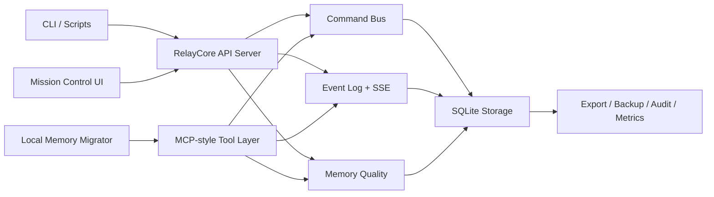

# RelayCore

> 面向 Codex、Claude 等本地 AI Runtime 的跨 Agent 记忆与命令中继控制面。

RelayCore 是这个项目当前统一的公开名称与内部实现名称。  
Python 包、CLI、文档与 GitHub 发布现已全部统一为 **RelayCore**。

## Chinese

RelayCore 是一个面向本地或自托管 AI Runtime 的共享记忆与命令中继项目。当前仓库包含：

- SQLite 共享存储
- 结构化 command bus
- append-only event timeline
- digest 生成
- MCP-style memory / command tools
- Mission Control Web UI
- export、backup、metrics、audit、CORS、token 相关接口
- 本地 Claude / Codex memory 迁移脚本

## English

RelayCore is a shared memory and command relay project for local or self-hosted AI runtimes. This repository currently includes:

- SQLite-backed shared storage
- a structured command bus
- an append-only event timeline
- digest generation
- MCP-style memory and command tools
- a Mission Control web UI
- export, backup, metrics, audit, CORS, and token-related surfaces
- local Claude/Codex memory migration scripts

## Documentation

- [构建路线图](docs/ROADMAP.md)
- [发布信息](docs/RELEASE_READINESS.md)
- [当前 Release 文案](docs/GITHUB_RELEASE_v0.1.2.md)

## 与 EastSword/EchoMemory 的关系

本项目**明确借鉴了** [EastSword/EchoMemory](https://github.com/EastSword/EchoMemory) 的公开思路与方向，尤其是：

- 多 Agent 共享记忆的产品定位
- 通过统一记忆层支撑不同智能体协作
- 将“共享上下文”从临时会话提升到可沉淀系统

这里保留这层致谢与标记，是为了对来源保持清晰说明，而不是弱化本项目的独立实现。

## Cross-Project Reference Table

The table below is limited to public repository descriptions and publicly visible interfaces.

| Project | Public description | Primary interfaces | Storage / runtime model in public materials | Public source |
| --- | --- | --- | --- | --- |
| RelayCore | Shared memory and command relay project for local or self-hosted AI runtimes | CLI, REST API, MCP-style tools, Web UI, migration script | SQLite-backed local/self-hosted Python project in this repository | [totooss/relaycore](https://github.com/totooss/relaycore) |
| EastSword/EchoMemory | Multi-agent shared memory project | Public repository description and project page references | Public materials referenced in this repository do not expose a full implementation matrix here | [EastSword/EchoMemory](https://github.com/EastSword/EchoMemory) |
| Mem0 | Universal memory layer for AI Agents | CLI, SDKs, managed/cloud materials, public repositories | Public README describes user/session/agent memory and managed service options | [mem0ai/mem0](https://github.com/mem0ai/mem0) |
| OpenMemory | Cognitive memory engine for LLMs and agents | Python SDK, Node SDK, server, MCP, UI, connectors | Public README describes local-first deployment with SQLite/Postgres options | [CaviraOSS/OpenMemory](https://github.com/CaviraOSS/OpenMemory) |
| Cognee | Open-source AI memory platform for agents | Python package, plugins, clients, knowledge-graph workflow, public docs | Public README describes a self-hosted knowledge graph engine with vector and graph components | [topoteretes/cognee](https://github.com/topoteretes/cognee) |

Notes:

- RelayCore entries describe the current contents of this repository.
- External project entries are paraphrased from public repository materials as of July 19, 2026.
- This table is descriptive only and does not rank or score the projects.

## 构建导图



## 快速开始

```bash
python -m venv .venv
source .venv/bin/activate
pip install -e .[dev]
relaycore init-db
relaycore serve --host 127.0.0.1 --port 8080
```

打开：

- `http://127.0.0.1:8080/mission-control`

也可以直接使用模块入口：

```bash
python -m relaycore init-db
python -m relaycore serve --host 127.0.0.1 --port 8080
```

## Memory 迁移

只预览、不写库：

```bash
python scripts/migrate_local_memories.py --dry-run
```

显式包含历史摘要和支持的 runtime store：

```bash
python scripts/migrate_local_memories.py --dry-run --include-history --include-runtime-store
```

实际导入：

```bash
python scripts/migrate_local_memories.py --session-id local-memory-migration
```

## CLI

CLI entrypoints:

```bash
relaycore init-db
relaycore serve
relaycore export
```

## 测试

```bash
pytest
```

Current local test result on July 19, 2026: `46 passed`

## 仓库结构

- `relaycore/`: 核心实现包
- `scripts/`: 迁移与辅助脚本
- `tests/`: 自动化测试
- `docs/`: 路线图、发布评估、阶段文档与决策记录

## 后续优化 Roadmap

### v0.2.x

- Docker 化
- 反向代理部署示例
- 环境变量与配置文档
- 更完整的 CLI smoke tests

### v0.3.x

- 在 Mission Control 中加入导入预览与勾选确认
- 增加更多 Claude / Codex source adapters
- 增加导入回滚与 snapshot 说明

### v0.4.x

- 更强的生产认证模型
- 更完整的 observability
- 恢复演练和运维 runbook

## 许可证

MIT，见 [LICENSE](LICENSE)。
