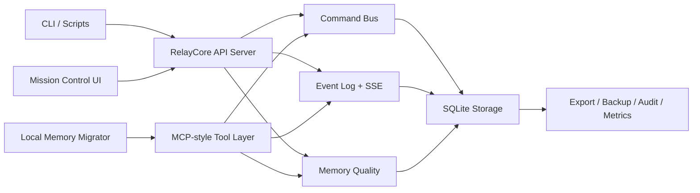

# RelayCore

> 面向 Codex、Claude 等本地 AI Runtime 的轻量级跨 Agent 记忆与命令中继控制面。

RelayCore 是这个项目当前统一的公开名称与内部实现名称。  
Python 包、CLI、文档与 GitHub 发布现已全部统一为 **RelayCore**。

## 中文说明

- [构建路线图](docs/ROADMAP.md)
- [发布就绪评估](docs/RELEASE_READINESS.md)
- [当前 Release 文案](docs/GITHUB_RELEASE_v0.1.2.md)

## 项目定位

RelayCore 解决的是一个很具体的问题：

- 多个 AI Runtime 需要共享同一条任务上下文
- 共享记忆不能只靠聊天历史
- 指令分发、事件时间线、审计、导出、迁移要在一个轻量系统里闭环

当前版本已经具备：

- SQLite 共享存储
- 结构化 command bus
- append-only event timeline
- digest 生成
- MCP-style memory / command tools
- Mission Control Web UI
- 基础安全边界
- 本地 Claude / Codex memory 迁移器

## 完成度判断

| 维度 | 当前判断 | 说明 |
| --- | --- | --- |
| 核心 MVP 完成度 | 高 | 存储、命令、事件、MCP、UI、安全、迁移链路已闭环 |
| GitHub 发布就绪度 | 高 | 已具备 README、License、CLI、CI、Roadmap、Release 文案 |
| 本地 / 内网试运行 | 可用 | 适合个人、多 Agent 协作、内部试点 |
| 互联网生产硬化 | 中等 | 还需更强认证、部署模板、恢复演练、观测深度 |

## 与 EastSword/EchoMemory 的关系

本项目**明确借鉴了** [EastSword/EchoMemory](https://github.com/EastSword/EchoMemory) 的公开思路与方向，尤其是：

- 多 Agent 共享记忆的产品定位
- 通过统一记忆层支撑不同智能体协作
- 将“共享上下文”从临时会话提升到可沉淀系统

这里保留这层致谢与标记，是为了对来源保持清晰说明，而不是弱化本项目的独立实现。

## 横向对比

下表基于本仓库当前公开实现，以及 `EastSword/EchoMemory` 公开仓库描述进行对比：

| 维度 | RelayCore | EastSword/EchoMemory |
| --- | --- | --- |
| 公开定位 | 跨 Runtime 的记忆 + 命令中继控制面 | 多 Agent 共享记忆系统 |
| 当前实现重点 | 记忆、命令、事件、Mission Control、安全、迁移 | 共享记忆产品方向与能力体系 |
| 运行形态 | 本地 / 自托管 SQLite MVP | 公开仓库显示为多 Agent 共享记忆项目 |
| 交互面 | REST API + MCP-style tools + Web UI + CLI | 以公开仓库说明为准 |
| 运维能力 | export、backup、metrics、audit、CORS、token baseline | 以公开仓库说明为准 |
| 数据迁移 | 已提供 Claude/Codex 本地 memory 迁移器 | 本仓库未直接复用其迁移实现 |
| 当前阶段 | 可公开发布的 GitHub MVP | 公开项目 / inspiration source |

说明：

- `EastSword/EchoMemory` 的定位描述来源于其公开仓库页面：`多Agent共享记忆`
- 上表只对公开可见定位和本仓库当前实现做对比，不臆测对方未公开的内部细节

## 构建导图



## 快速开始

```bash
python -m venv .venv
source .venv/bin/activate
pip install -e .[dev]
relaycore init-db
relaycore serve --host 127.0.0.1 --port 8080
```

打开：

- `http://127.0.0.1:8080/mission-control`

也可以直接使用模块入口：

```bash
python -m relaycore init-db
python -m relaycore serve --host 127.0.0.1 --port 8080
```

## Memory 迁移

只预览、不写库：

```bash
python scripts/migrate_local_memories.py --dry-run
```

显式包含历史摘要和支持的 runtime store：

```bash
python scripts/migrate_local_memories.py --dry-run --include-history --include-runtime-store
```

实际导入：

```bash
python scripts/migrate_local_memories.py --session-id local-memory-migration
```

## CLI

对外推荐使用 `relaycore`：

```bash
relaycore init-db
relaycore serve
relaycore export
```

## 测试

```bash
pytest
```

当前本地验证状态（2026 年 7 月 19 日）：`46 passed`

## 仓库结构

- `relaycore/`: 核心实现包
- `scripts/`: 迁移与辅助脚本
- `tests/`: 自动化测试
- `docs/`: 路线图、发布评估、阶段文档与决策记录

## 后续优化 Roadmap

### v0.2.x

- Docker 化
- 反向代理部署示例
- 环境变量与配置文档
- 更完整的 CLI smoke tests

### v0.3.x

- 在 Mission Control 中加入导入预览与勾选确认
- 增加更多 Claude / Codex source adapters
- 增加导入回滚与 snapshot 说明

### v0.4.x

- 更强的生产认证模型
- 更完整的 observability
- 恢复演练和运维 runbook

## 许可证

MIT，见 [LICENSE](LICENSE)。
